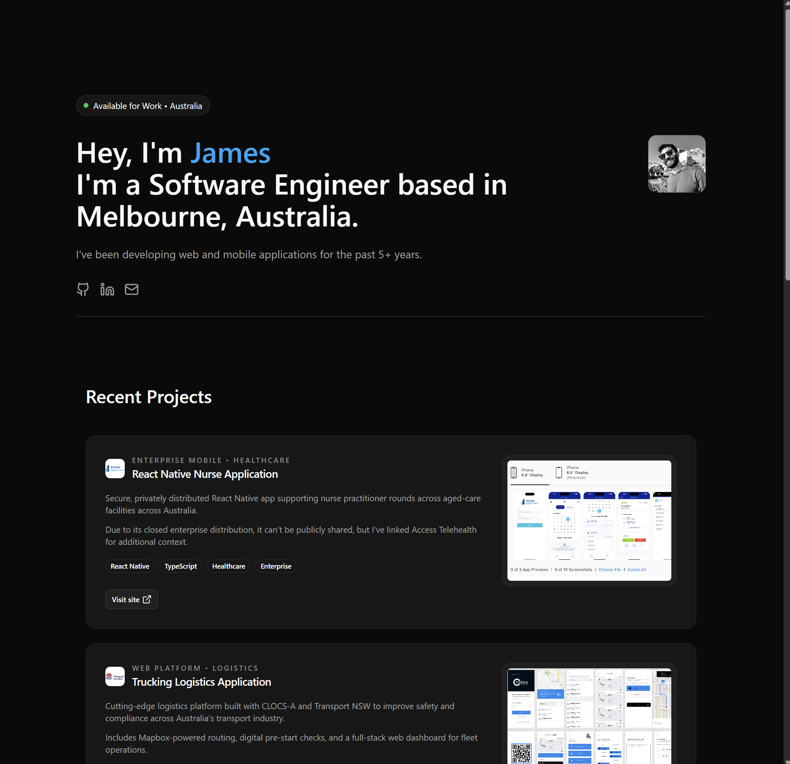

# jamesvovos.com

My personal software engineering portfolio — built with **Next.js**, **TypeScript**, **Tailwind CSS**, and **Shadcn UI**.  

This project serves as a fast, minimal, and clean landing page for my professional profile.

---

## 📸 Preview



---

## 🚀 Tech Stack

- **Next.js 16 (App Router)**
- **TypeScript**
- **Bun**
- **React**
- **Tailwind CSS**
- **Shadcn/UI**
- **Deployed on Vercel**

---

## 🧑‍💻 About This Site

The site highlights:

- **Intro** — Software Engineer based in Melbourne, Australia  
- **Recent projects** — real-world applications in healthcare and logistics  
- **Tech stack overview** — languages and frameworks I am most familiar with
- **Testimonials** — from engineering managers  
- **Contact links** — for work opportunities or collaborations  

It’s intentionally lightweight and content-focused, designed to load quickly and work well on all devices.

---

## 🛠 Development

To run locally:

```bash
bun install
bun dev
```
